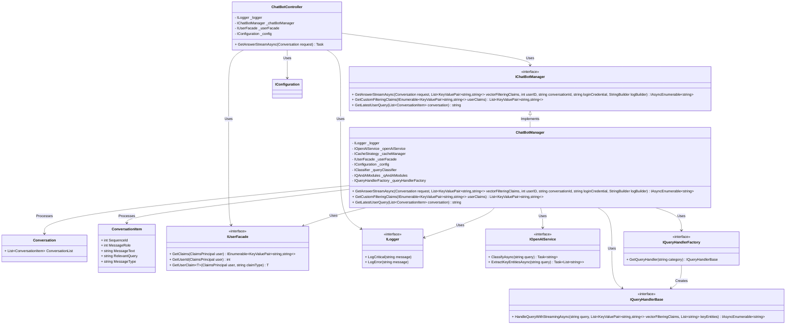
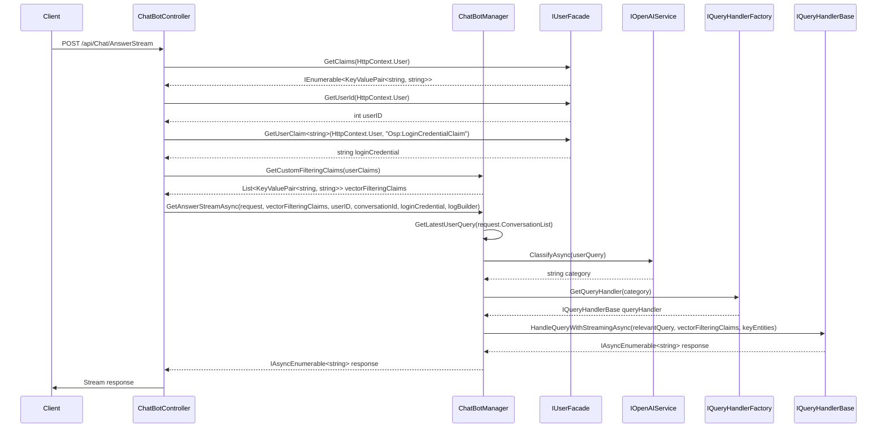

# some concepts in c++

```mermaid
classDiagram
    %% Classes and Interfaces
    class ChatBotController {
        - ILogger _logger
        - IChatBotManager _chatBotManager
        - IUserFacade _userFacade
        - IConfiguration _config
        + GetAnswerStreamAsync(Conversation request) Task
    }

    class IChatBotManager {
        <<interface>>
        + GetAnswerStreamAsync(Conversation request, List~KeyValuePair~string,string~~ vectorFilteringClaims, int userID, string conversationId, string loginCredential, StringBuilder logBuilder) IAsyncEnumerable~string~
        + GetCustomFilteringClaims(IEnumerable~KeyValuePair~string,string~~ userClaims) List~KeyValuePair~string,string~~
        + GetLatestUserQuery(List~ConversationItem~ conversation) string
    }

    class ChatBotManager {
        - ILogger _logger
        - IOpenAIService _openAIService
        - ICacheStrategy _cacheManager
        - IUserFacade _userFacade
        - IConfiguration _config
        - IClassifier _queryClassifier
        - IQAndAModules _qAndAModules
        - IQueryHandlerFactory _queryHandlerFactory
        + GetAnswerStreamAsync(Conversation request, List~KeyValuePair~string,string~~ vectorFilteringClaims, int userID, string conversationId, string loginCredential, StringBuilder logBuilder) IAsyncEnumerable~string~
        + GetCustomFilteringClaims(IEnumerable~KeyValuePair~string,string~~ userClaims) List~KeyValuePair~string,string~~
        + GetLatestUserQuery(List~ConversationItem~ conversation) string
    }

    class Conversation {
        + List~ConversationItem~ ConversationList
    }

    class ConversationItem {
        + int SequenceId
        + int MessageRole
        + string MessageText
        + string RelevantQuery
        + string MessageType
    }

    class IUserFacade {
        <<interface>>
        + GetClaims(ClaimsPrincipal user) IEnumerable~KeyValuePair~string,string~~
        + GetUserId(ClaimsPrincipal user) int
        + GetUserClaim~T~(ClaimsPrincipal user, string claimType) T
    }

    class ILogger {
        <<interface>>
        + LogCritical(string message)
        + LogError(string message)
    }

    class IOpenAIService {
        <<interface>>
        + ClassifyAsync(string query) Task~string~
        + ExtractKeyEntitiesAsync(string query) Task~List~string~~
    }

    class IQueryHandlerFactory {
        <<interface>>
        + GetQueryHandler(string category) IQueryHandlerBase
    }

    class IQueryHandlerBase {
        <<interface>>
        + HandleQueryWithStreamingAsync(string query, List~KeyValuePair~string,string~~ vectorFilteringClaims, List~string~ keyEntities) IAsyncEnumerable~string~
    }

    %% Relationships
    ChatBotController --> IChatBotManager : Uses
    ChatBotController --> IUserFacade : Uses
    ChatBotController --> ILogger : Uses
    ChatBotController --> IConfiguration : Uses
    IChatBotManager <|-- ChatBotManager : Implements
    ChatBotManager --> IOpenAIService : Uses
    ChatBotManager --> IQueryHandlerFactory : Uses
    ChatBotManager --> IUserFacade : Uses
    ChatBotManager --> ILogger : Uses
    ChatBotManager --> Conversation : Processes
    ChatBotManager --> ConversationItem : Processes
    ChatBotManager --> IQueryHandlerBase : Uses
    IQueryHandlerFactory --> IQueryHandlerBase : Creates

```

```mermaid
sequenceDiagram
    participant Client
    participant ChatBotController
    participant ChatBotManager
    participant IUserFacade
    participant IOpenAIService
    participant IQueryHandlerFactory
    participant IQueryHandlerBase

    Client->>ChatBotController: POST /api/Chat/AnswerStream
    ChatBotController->>IUserFacade: GetClaims(HttpContext.User)
    IUserFacade-->>ChatBotController: IEnumerable<KeyValuePair<string, string>>
    ChatBotController->>IUserFacade: GetUserId(HttpContext.User)
    IUserFacade-->>ChatBotController: int userID
    ChatBotController->>IUserFacade: GetUserClaim<string>(HttpContext.User, "Osp:LoginCredentialClaim")
    IUserFacade-->>ChatBotController: string loginCredential
    ChatBotController->>ChatBotManager: GetCustomFilteringClaims(userClaims)
    ChatBotManager-->>ChatBotController: List<KeyValuePair<string, string>> vectorFilteringClaims
    ChatBotController->>ChatBotManager: GetAnswerStreamAsync(request, vectorFilteringClaims, userID, conversationId, loginCredential, logBuilder)
    ChatBotManager->>ChatBotManager: GetLatestUserQuery(request.ConversationList)
    ChatBotManager->>IOpenAIService: ClassifyAsync(userQuery)
    IOpenAIService-->>ChatBotManager: string category
    ChatBotManager->>IQueryHandlerFactory: GetQueryHandler(category)
    IQueryHandlerFactory-->>ChatBotManager: IQueryHandlerBase queryHandler
    ChatBotManager->>IQueryHandlerBase: HandleQueryWithStreamingAsync(relevantQuery, vectorFilteringClaims, keyEntities)
    IQueryHandlerBase-->>ChatBotManager: IAsyncEnumerable<string> response
    ChatBotManager-->>ChatBotController: IAsyncEnumerable<string> response
    ChatBotController->>Client: Stream response
```
